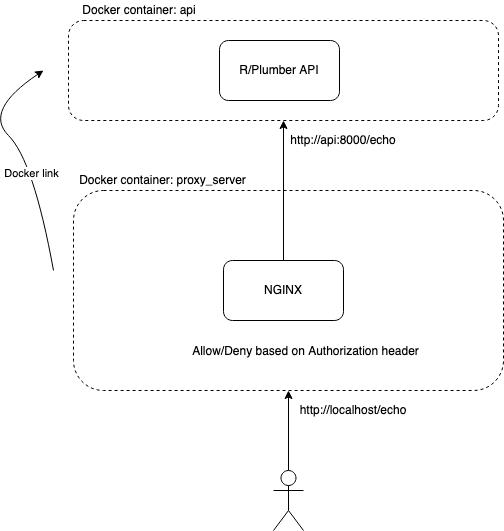

### What is this?

This is an example to illustrate how to build a REST API with R and Plumber library secured by an NGINX proxy server by checking Authorization header.

Authorization header check is configured in `nginx.conf` file.



### Usage

#### Run API and Proxy Server
```
$ make start
```

#### Make request to endpoint
```
$ curl --header "Authorization: Bearer 1234" "http://localhost/echo?msg=Hello"

```

